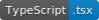

# IP Location

</img>
</img>
</img>

Enter someone's IP and locate them.

</img>
 
---

The website is running live right here:

[nova-script.github.io/IP-location/](nova-script.github.io/IP-location/)
